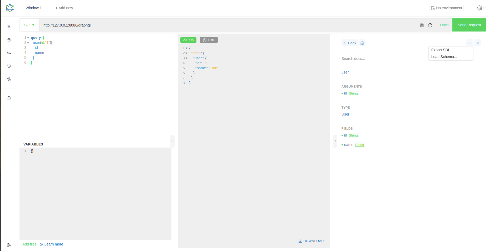
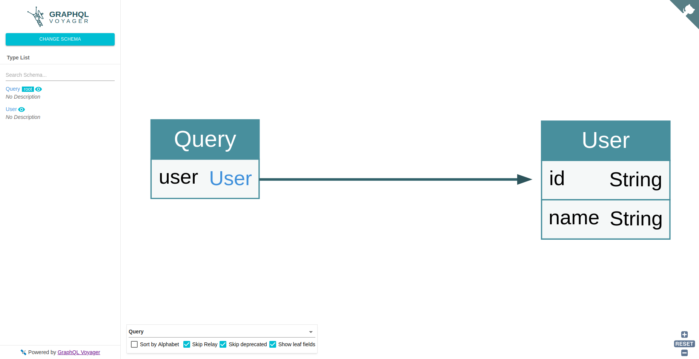

# 访问方式:

终端:

`curl -g 'http://127.0.0.1:8080/graphql?query={user(id:"1"){name}}'`

工具:

谷歌浏览器插件[Altair](https://github.com/imolorhe/altair)

在api可视化[graphql-voyager](https://apis.guru/graphql-voyager/)页面粘贴导出的sdl

