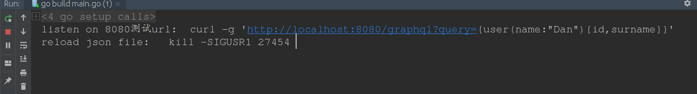
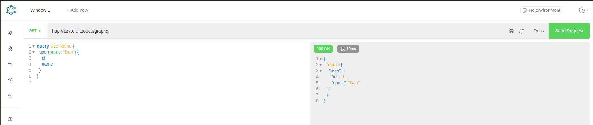
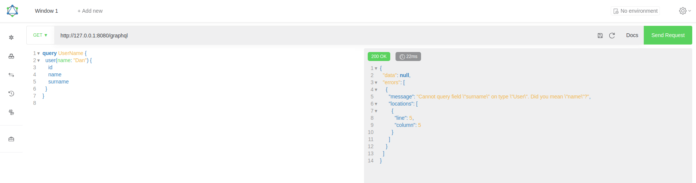
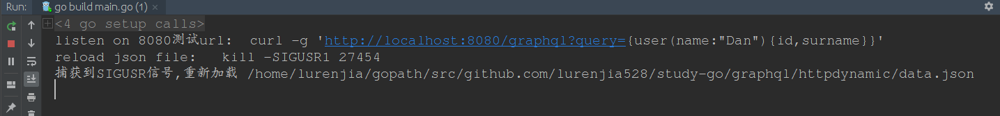
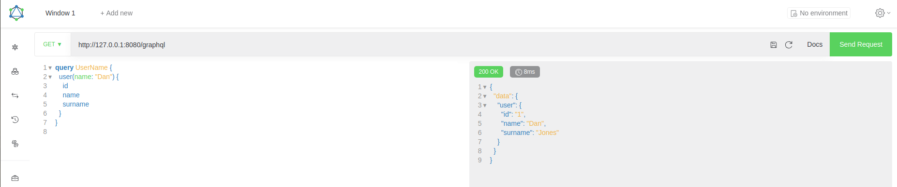

# 动态加载数据文件



```json
[
  {
    "id": "1",
    "name": "Dan"
  },
  {
    "id": "2",
    "name": "Lee"
  },
  {
    "id": "3",
    "name": "Nick"
  }
]
```





修改data.json

```json
[
  {
    "id": "1",
    "name": "Dan",
    "surname": "Jones"
  },
  {
    "id": "2",
    "name": "Lee"
  },
  {
    "id": "3",
    "name": "Nick"
  }
]
```

发送信号
`kill -SIGUSR1 27454 `



重新查询

